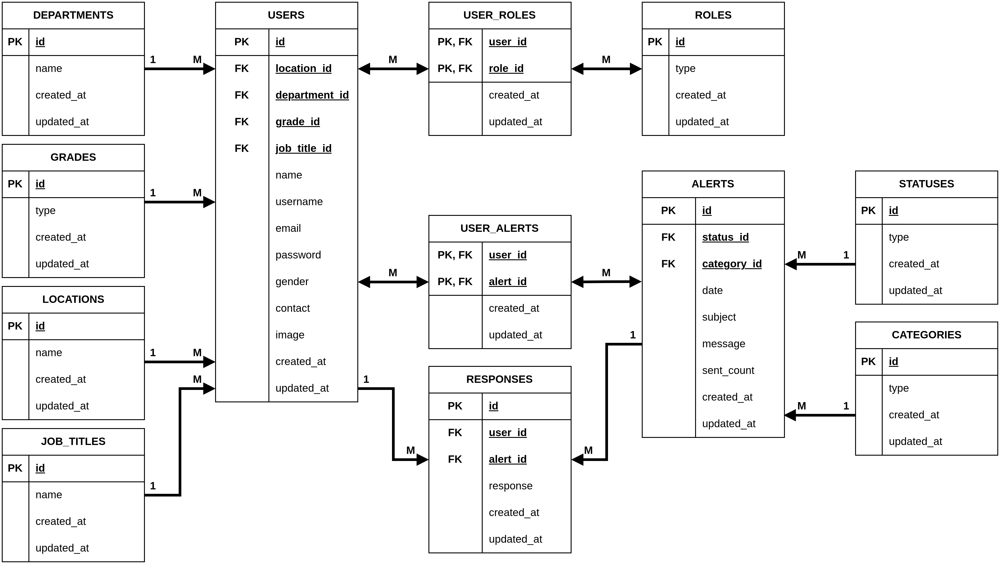

<p align="center">
  
</p>

<h1 align="center">EM-Urgency – Backend API</h1>

<p>
  A secure, role-based backend API that powers <b>EM-Urgency</b> — an internal emergency alert & response tracking system.
  <br/>
  Built using <b>Node.js</b>, <b>Express</b>, <b>Sequelize ORM</b>, and <b>MySQL</b>, with Docker-based deployment support.
</p>

<p>
  <b>EM-Urgency</b> helps organizations broadcast critical alerts (announcements, events, holidays, outages) to employees and track responses in real-time.
  The backend handles authentication & authorization, alert distribution, response capture, admin analytics endpoints (pie/bar charts), and email notifications.
</p>

<p>
  <b>Related repository (Frontend UI):</b>
  <br/>
  https://github.com/adnanmk-1999/EM_Urgency_Frontend
</p>

# 📚 Table of Contents

1. [🏥 About the Backend](#-about-the-backend)
2. [🧱 Technology Stack](#-technology-stack)
3. [🏛️ System Architecture](#️-system-architecture)
4. [🗂️ Folder Structure](#-folder-structure)
5. [⚙️ Environment Configuration](#️-environment-configuration)
6. [💻 Getting Started with the Server](#-getting-started-with-the-server)
7. [🧪 API Overview](#-api-overview)
8. [🔮 Future Enhancements](#-future-enhancements)
9. [👤 Author](#-author)

# 🏥 About the Backend

The **EM-Urgency Backend** is the core server-side application that powers the EM-Urgency emergency communication platform. It is responsible for managing all business logic and system operations, including authentication, role-based access control, alert distribution, email notifications, response tracking, and analytics data consumed by the frontend dashboards.

This backend exposes a secure RESTful API that enables administrators to create, manage, and distribute emergency alerts to targeted users based on departments, locations, or individual selection. At the same time, it allows users to receive alerts, submit responses, and have their actions recorded reliably within the system.

The backend is designed around a role-based model, ensuring that administrative actions and user interactions are strictly separated. Admin users have the ability to manage alert lifecycles, track delivery and response status, and access aggregated analytics, while regular users are limited to viewing alerts and submitting responses.

Security and scalability are core considerations of the system. Authentication and authorization are handled using JSON Web Tokens (JWT), and all database interactions are abstracted through an ORM layer to ensure consistency and maintainability. Email notifications are integrated directly into the backend using SMTP, ensuring that alerts are delivered even when users are not actively logged into the application.

The application follows a modular and container-friendly architecture, making it suitable for deployment in Dockerized environments and adaptable for future extensions such as additional notification channels, real-time updates, or enterprise-scale deployments.

# 🧱 Technology Stack

| Layer | Tools |
|------|--------|
| **Runtime** | Node.js (v14) |
| **Framework** | Express.js |
| **ORM** | Sequelize |
| **Database** | MySQL (Dockerized) |
| **Authentication** | JWT-based Authentication (Access & Refresh Tokens) |
| **Email Service** | Nodemailer (SMTP – Gmail) |
| **Templating** | Handlebars (Email Templates) |
| **Deployment** | Docker + Docker Compose |
| **Environment Management** | dotenv (multi-file environment configuration) |
| **Logging** | Console logs + Docker logs |
| **Architecture** | MVC Pattern with DAO Layer |

# 🏛️ System Architecture

The EM-Urgency backend follows a clean and modular architecture designed to separate concerns and keep the codebase scalable, maintainable, and easy to extend.  
At a high level, the system is structured around the following layers:

- **Routes** – Define REST API endpoints and map them to controllers  
- **Controllers** – Handle request validation, role checks, business flow, and responses  
- **DAO Layer** – Encapsulates all database operations using Sequelize  
- **Models** – Represent database tables and relationships using Sequelize ORM  
- **Config Layer** – Manages database connections, environment variables, and authentication configuration  
- **Helpers / Services** – Shared utilities such as email notifications, token handling, and chart data preparation  

This layered architecture ensures:

- Clear separation between API logic and data access  
- Better maintainability and readability  
- Easier debugging and testing  
- Smooth scalability as new features are introduced  


## 🗄️ Database Architecture (ERD)

The backend database is designed to support **role-based alert distribution and response tracking**.  
The Entity Relationship Diagram (ERD) defines how alerts, users, responses, and organizational entities interact with each other.

<p align="center">
  
</p>

The database design supports:

- **Multiple user roles** (Admin, User)
- **Alert lifecycle management** (Draft, Sent, Failed)
- **Many-to-many relationships** between users and alerts
- **Response tracking** for each user–alert combination
- **Department and location-based user grouping**
- **Analytics aggregation** for dashboards (pie and bar charts)

This ERD directly maps to the Sequelize models used in the backend and forms the foundation for alert distribution, response collection, and reporting workflows.

# 📁 Folder Structure

The EM-Urgency backend is organized using a clean **MVC + DAO architecture**, ensuring clear separation of concerns and long-term maintainability.  
Below is the high-level folder structure with an explanation of each major directory:

```
EM_Urgency_Backend/
│
├── config/
│   ├── database.config.js     # Sequelize database connection (MySQL)
│   ├── auth.config.js         # JWT secrets and token configuration
│
├── controllers/               # Handles request logic and API responses
│   ├── auth.controller.js
│   ├── admin.controller.js
│   ├── user.controller.js
│   ├── alert.controller.js
│   └── response.controller.js
│
├── dao/                       # Data Access Layer (Sequelize queries)
│   ├── user.dao.js
│   ├── alert.dao.js
│   ├── response.dao.js
│   └── role.dao.js
│
├── models/                    # Sequelize models representing database tables
│   ├── user.model.js
│   ├── alert.model.js
│   ├── response.model.js
│   ├── role.model.js
│   ├── department.model.js
│   └── location.model.js
│
├── routes/                    # API routes (maps URLs → controllers)
│   ├── auth.routes.js
│   ├── admin.routes.js
│   ├── user.routes.js
│   └── alert.routes.js
│
├── helpers/                   # Shared utilities and helper functions
│   ├── email.helper.js        # Nodemailer email handling
│   ├── token.helper.js        # JWT utilities
│   └── chart.helper.js        # Analytics aggregation logic
│
├── views/                     # Email templates (Handlebars)
│   └── email.handlebars
│
├── seed.js                    # Seeds roles, users, departments, locations
│
├── Dockerfile                 # Backend Docker image definition
├── docker-compose.yml         # Docker orchestration (Backend + MySQL)
│
├── .env                       # Global runtime variables
├── .env.mysql                 # MySQL environment configuration
│
└── index.js                   # Backend application entry point
```

This structure enables the backend to scale cleanly as new features such as additional notification channels, reporting modules, or role types are introduced.

# ⚙️ Environment Configuration

The EM-Urgency backend uses **multiple environment files** to manage configuration across development and Docker-based deployments.  
These files control server settings, database connections, authentication secrets, and email credentials.

### **1. `.env` — Main Runtime Environment**

This file contains global runtime configuration used by the backend server.

```env
PORT=4000

JWT_SECRET=your_jwt_secret
JWT_REFRESH_SECRET=your_jwt_refresh_secret

ACCESS_TOKEN_LIFE=3600
REFRESH_TOKEN_LIFE=86400
```

**Used for:**
- Setting the backend server port  
- JWT authentication and token lifecycle configuration  


### **2. `.env.mysql` — MySQL (Docker Environment)**

This file is used when running the backend inside Docker with a MySQL container.

```env
DB_HOST=mysql
DB_PORT=3306
DB_USER=emurgency_user
DB_PASSWORD=emurgency_password
DB_NAME=em_urgency
```

**Used for:**
- Database host and port mapping inside Docker  
- MySQL authentication credentials  
- Schema initialization for Sequelize  


### **3. `.env.email` — Email Notification Configuration**

This file contains credentials used by the email notification service (Nodemailer).

```env
EMAIL=your_email@gmail.com
MAILPASSWORD=your_gmail_app_password
```

**Used for:**
- Sending alert notifications via email  
- SMTP authentication (Gmail App Password recommended)  

> ⚠️ **Important:**  
> For Gmail, regular account passwords will not work.  
> You must generate an **App Password** and use it here.


### 🔐 Security Notes

- Environment files should **never be committed** to version control  
- Use `.gitignore` to exclude all `.env*` files  
- Secrets should be rotated for production deployments  

This configuration structure allows the backend to run reliably across local, Dockerized, and production environments.

# 🚀 Getting Started with the Server

This section explains how to run the **EM-Urgency Backend Server** in two ways:

- **Using Docker (Recommended)**
- **Running Locally without Docker**

Both methods use **MySQL as the database**. There is no environment-based database switching; the same database configuration applies for local and containerized setups.


## 🐳 Running with Docker (Recommended)

Using Docker provides the most consistent and reproducible environment.  
It automatically starts:

- The **backend API server**
- The **MySQL database container**

### ✅ Prerequisites

- Docker installed and running
- `.env` and `.env.mysql` files present in the project root

### ▶️ Start the server with Docker

```bash
docker compose up --build
```

This will:
- Build the backend Docker image  
- Start the MySQL container  
- Load environment variables  
- Initialize Sequelize models  
- Run the backend server  

By default, the backend will be available at:

```
http://localhost:4000
```

(Or the port specified in `.env`.)

## 💻 Running the Backend Locally (Without Docker)

The backend can also be run locally while still connecting to a **MySQL database**.  
This mode is useful for development and debugging.

### ✅ Prerequisites

- Node.js (v14 recommended)
- MySQL installed and running locally
- `.env` and `.env.mysql` properly configured


### ▶️ 1. Install dependencies

```bash
npm install
```


### ▶️ 2. Start the backend server

```bash
npm start
```

This will:
- Load environment variables from `.env` and `.env.mysql`
- Connect to the configured MySQL database
- Start the Express server

The backend will run on the port defined in `.env`.


## 🔄 Environment Behavior

The backend always loads configuration in the following order:

1. `.env` — Global runtime settings (PORT, JWT secrets)
2. `.env.mysql` — Database configuration (MySQL credentials)

This ensures consistent behavior across both **local** and **Docker-based** deployments.

> ℹ️ There is no database dialect switching in this project.  
> MySQL is used as the primary and only database for all environments.

# 🧪 API Overview

The EM-Urgency Backend exposes a RESTful API that supports authentication, alert management, response tracking, user targeting, and analytics used by the frontend dashboards.  
Below is a simplified overview of the main API groups and commonly used endpoints.


## 🔐 Authentication

```
POST /auth/login
POST /auth/refresh-token
```

Used by all users to authenticate and receive JWT access and refresh tokens.


## 👤 Users

```
GET /users                     # List all users (Admin only)
GET /users/:id                 # Fetch user by ID
GET /users/email/:email        # Fetch user by email
```

Users are associated with departments and locations, enabling targeted alert distribution.

## 🚨 Alerts

```
POST /alerts                   # Create new alert (Admin)
GET /alerts                    # List all alerts
GET /alerts/:id                # Fetch alert details
PUT /alerts/:id                # Update alert (Draft / Failed)
DELETE /alerts/:id             # Delete alert
```

Alerts can exist in Draft, Sent, or Failed states depending on delivery status.

## 📤 Alert Distribution

```
POST /alerts/send/all           # Send alert to all users
POST /alerts/send/department    # Send alert by department
POST /alerts/send/location      # Send alert by location
POST /alerts/send/individual    # Send alert to specific users
```

These endpoints trigger email notifications and create alert–user mappings.


## ✅ Responses

```
PUT /users/response/:id         # Submit user response (Accept / Reject)
GET /responses/alert/:id        # Get responses for a specific alert
```

Each response is linked to a user and an alert for tracking and analytics.


## 📊 Analytics (Admin Only)

```
GET /admin/piechartsent         # Sent vs Draft vs Failed alerts
GET /admin/piechartfailed
GET /admin/piechartdraft
POST /admin/barchart            # Response vs Unresponse data
```

These endpoints provide aggregated data for charts displayed in the admin dashboard.


### ✔ General Notes

- All protected routes require a valid **JWT access token**.
- Admin-only endpoints enforce role-based access control.
- API responses generally follow the format:

```
{
  success: true/false,
  message: "...",
  data: {...}
}
```

This overview provides a high-level understanding of the backend API and its role in powering the EM-Urgency application.

# 🔮 Future Enhancements

The EM-Urgency backend is fully functional and production-ready, but several enhancements are planned to further improve scalability, maintainability, and system robustness. Below are potential future improvements:

### 🚀 1. Schema-Based Input Validation
Introduce request validation using libraries such as **Zod** or **Joi** to enforce strict data validation for all incoming API requests, ensuring better error handling and improved API reliability.

### 🧱 2. Dedicated Service Layer
Refactor business logic from controllers into a centralized **service layer** to improve separation of concerns, enhance testability, and promote code reuse across the application.

### 📘 3. Swagger / OpenAPI Documentation
Add interactive API documentation using **Swagger** or **OpenAPI** to provide clear endpoint definitions, request/response schemas, and authentication details for developers and integrators.

### ⚡ 4. Real-Time Notifications
Extend the notification system with **WebSockets** or **Server-Sent Events (SSE)** to provide real-time alert status updates and response tracking within the application dashboard.

### 📊 5. Advanced Analytics & Reporting
Enhance analytics by adding historical trend analysis, downloadable reports (CSV/PDF), response-time metrics, and alert effectiveness insights for administrative users.

These enhancements aim to make EM-Urgency more scalable, developer-friendly, and suitable for enterprise-grade deployments.


# 👤 Author

Developed by **Adnan**  
Software Developer & Robotics Engineer  

This project was built as part of hands-on learning and system design practice, focusing on scalable backend architecture, role-based access control, and real-world alerting workflows.
